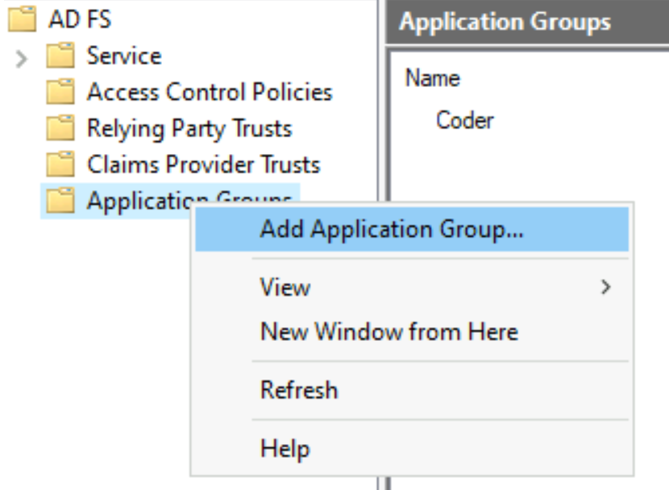
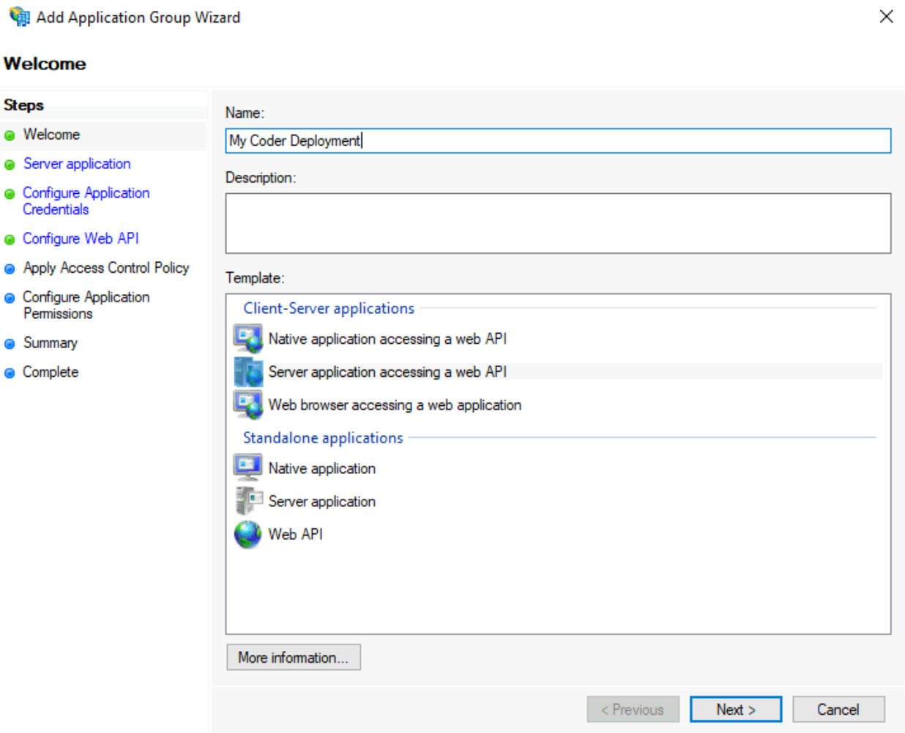
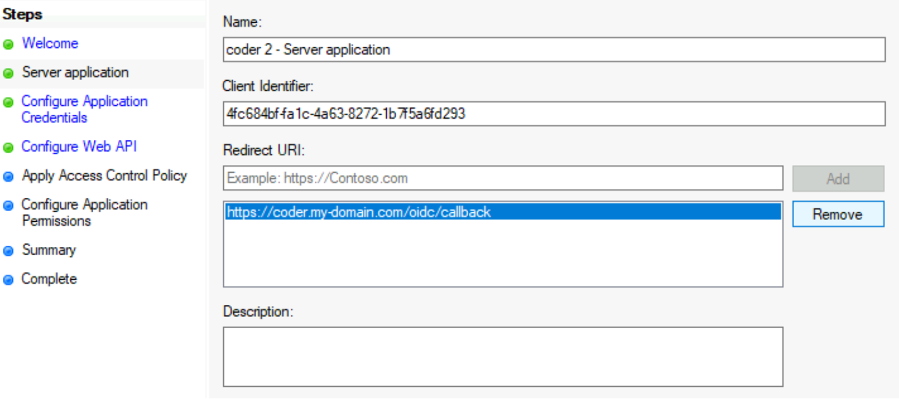
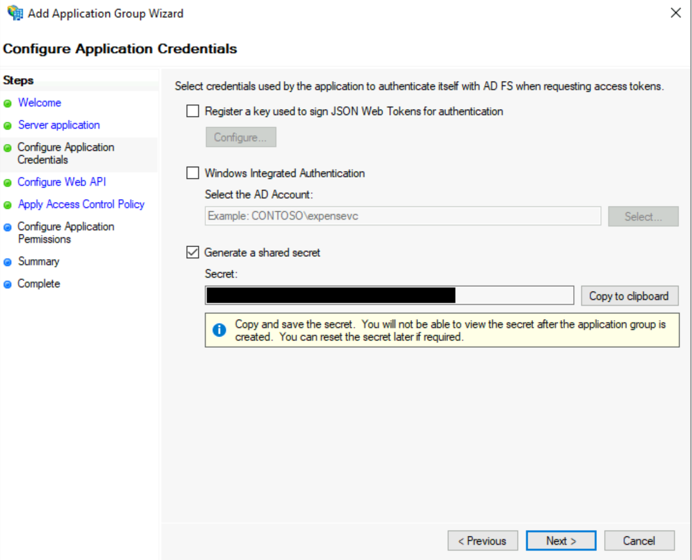
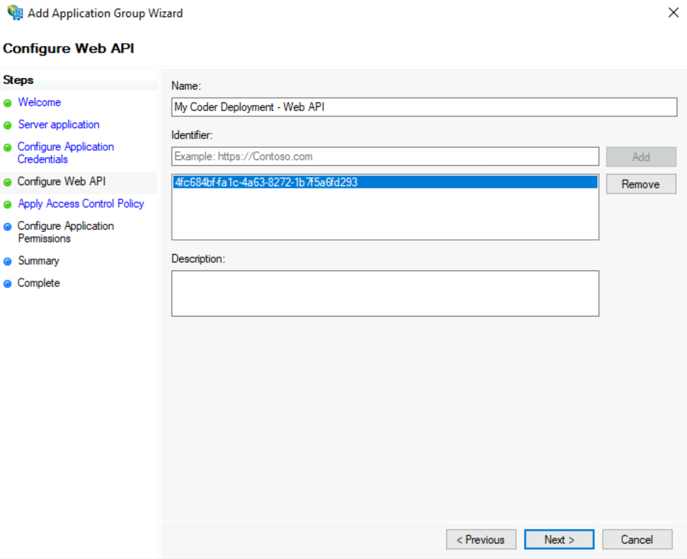
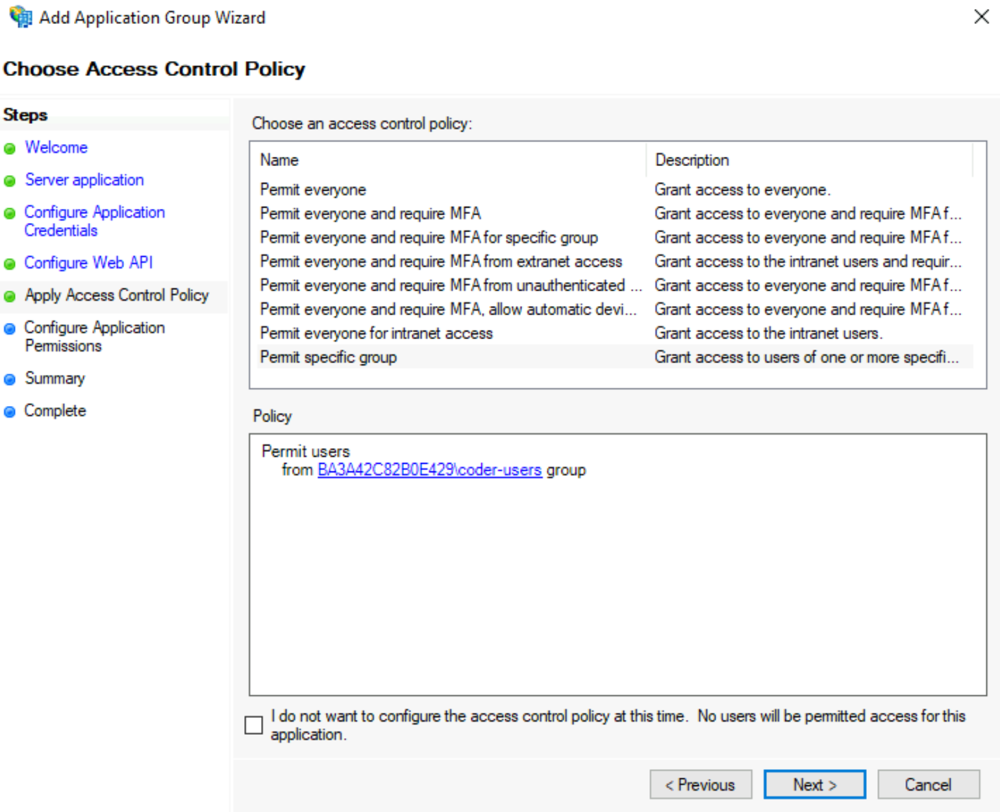
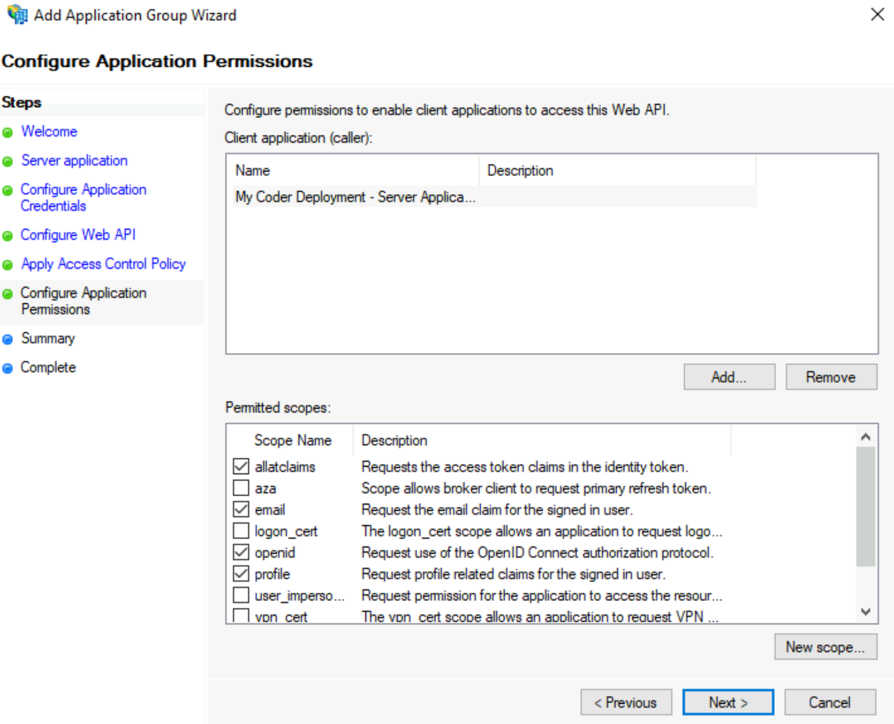
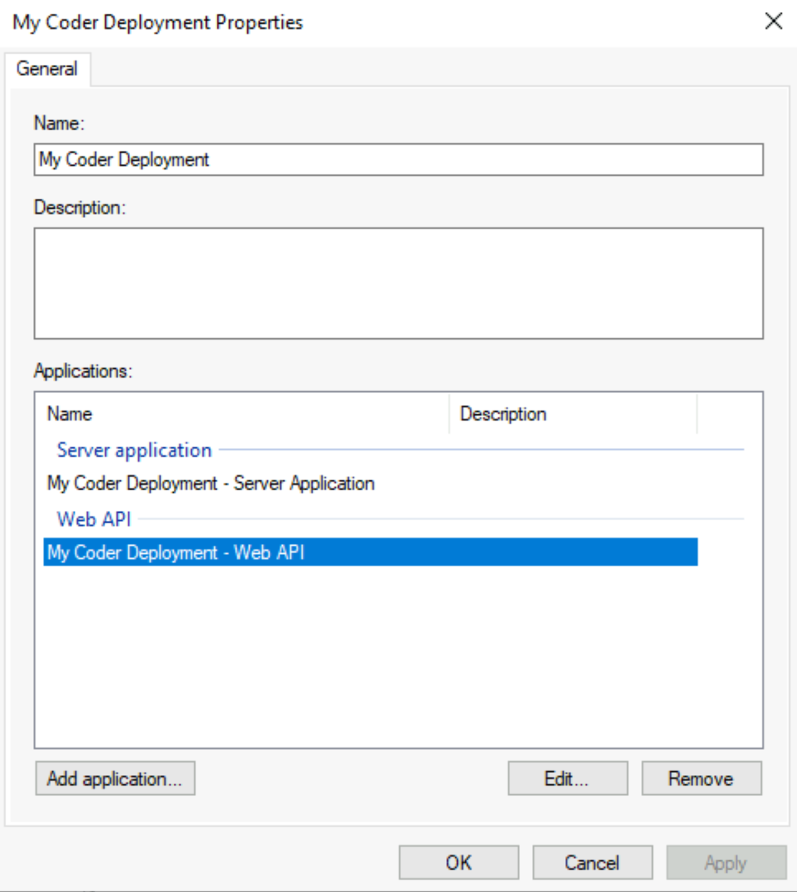
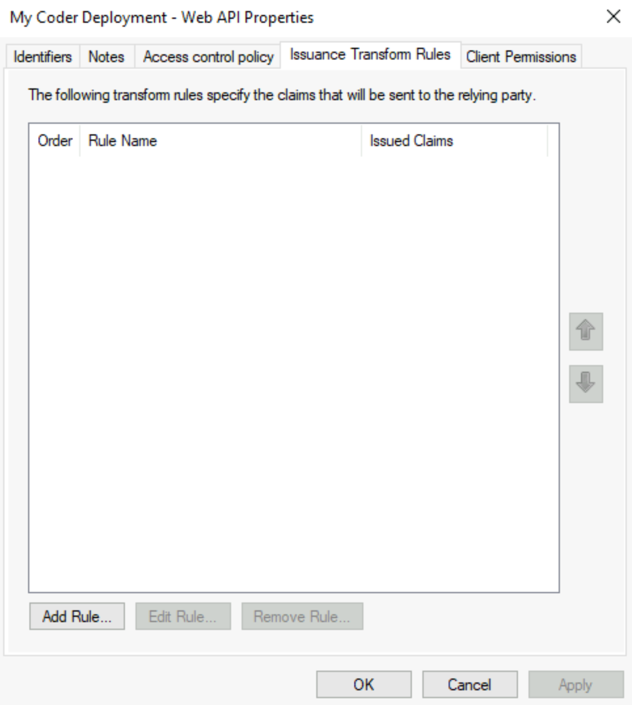

This article walks you through setting up single sign-on to Coder using Azure's
Active Directory Federation Services (ADFS).

Configuring
[Coder's OpenID Connect](../../admin/access-control/index.md#openid-connect)
feature requires you to provide three pieces of information from Azure:

- Client ID
- Client Secret
- Issuer

This guide will show you how to set up Azure's Active Directory Federation
Services and obtain the information you need to provide to Coder.

## Step 1: Create a new application group for Coder

1. On the server running ADFS, open Server Manager and go to **Tools** > **AD FS
   Management**.

   

1. In the left-hand pane, right-click on **Application Groups** and select **Add
   Application Group...**.

   

1. In the prompt window that appears, enter a **Name** and a **Description**
   (optional). Under **Template**, select **Server application accessing a web
   API**. Click **Next** to proceed.

   

1. In the next prompt window, you'll see a **Client identifier**. Save this
   value, since you'll need to provide it at a later step. Next, provide a
   **Redirect URI** (this value should be
   `https://coder.your-domain.com/oidc/callback`) and click **Add**. Then, click
   **Next** to proceed.

   

1. In the next screen, titled **Configure Application Credentials**, click the
   **Generate a shared secret** checkbox. Note the **Secret** value that
   appears, since you'll need to provide this to Coder at a later step. Click
   **Next** to proceed.

   

1. In the next step, **Configure Web API**, enter the **Client identifier** that
   you saved in step 4 in the field called **Identified** and click **Add**.
   Click **Next** to proceed.

   

1. On the **Choose Access Control Policy** screen, choose your preferred access
   control policy, and click **Next** to proceed.

   In the example below, we permit members of a specific group `coder-users` to
   access Coder.

   

1. For the step **Configure Application Permissions**, select the following
   **Permitted scopes**:

   - `allataclaims`
   - `email`
   - `openid`
   - `profile`

   Click **Next** to proceed.

   

1. Finally, in the **Summary** window, review the information you've provided.
   Click **Next** when you're ready to proceed and close the setup wizard.

## Step 2: Modify the claim rules

In this step, you'll ensure that the access tokens sent by ADFS include the
following
[OIDC standard claims](https://openid.net/specs/openid-connect-core-1_0.html#StandardClaims):
`name` and `email`.

1. In Server Manager, double-click on your newly created application group.

1. Under **Applications**, select the **Web API** application and click
   **Edit**.

   

1. Select the tab **Issuance Transform Rules** and click **Add Rule...**. This
   will open the **Add Transform Claim Rule Wizard**.

   

1. In the rule wizard, under **Claim rule template**, select the option to
   **Send Claims using a Custom Rule**, and click **Next**.

1. Enter a name for the claim rule.

1. In the **Custom Rule** field, enter a claim rule written in the
   [ADFS Claim Rule Language](https://docs.microsoft.com/en-us/windows-server/identity/ad-fs/technical-reference/the-role-of-the-claim-rule-language).

   The following example claim rule maps the Active Directory attributes
   `userPrincipalName` and `displayName` as `email` and `name`, respectively:

   ```text
   c:[Type ==
   "http://schemas.microsoft.com/ws/2008/06/identity/claims/windowsaccountname",
   Issuer == "AD AUTHORITY"]
   => issue(store = "Active Directory", types = ("email", "name"),
   query = ";userPrincipalName,displayName;{0}", param = c.Value);
   ```

   > For more information, see
   > [Create a Rule to Send Claims Using a Custom Rule](https://docs.microsoft.com/en-us/windows-server/identity/ad-fs/operations/create-a-rule-to-send-claims-using-a-custom-rule)

## Step 3: Gather information for Coder authentication

Once you've created your application group, you'll have the **Client ID** and
**Client Secret**. However, you still need the **issuer**, which you can get by
running the `Get-ADFSProperties` Powershell cmdlet on the server running ADFS:

```console
Get-ADFSProperties | Select IdTokenIssuer
```

You should see something similar for the output:

```console
PS C:\Users\coder> Get-ADFSProperties | Select IdTokenIssuer

IdTokenIssuer
- - - - - - -
https://dc1.ba3...da221.westeurope.aksapp.io/adfs
```

## Step 4: Configure Coder authentication

At this point, you can continue with configuring authentication in Coder.

1. Log into Coder and go to **Manage** > **Admin** > **Authentication**.

1. In the top-most drop-down box, select **OpenID Connect**.

1. Provide the requested values for **Client ID**, **Client Secret**, and
   **Issuer**.

When done, click **Save Preferences**. At this point, Coder validates your
configuration before proceeding. If successful, you can expect Coder to send
OIDC login attempts to your configured ADFS instance.
